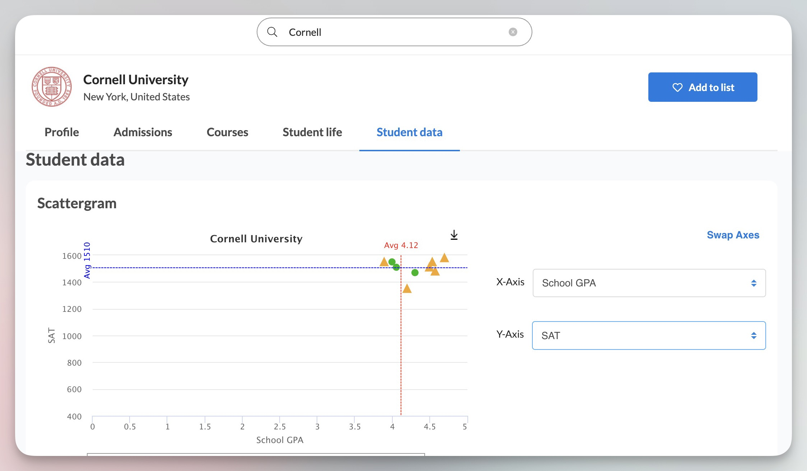

# 关于申请大学
不同于国内大学只需要一场考试就能进入，每个国家和地区的大学对于申请的要求都不一样，例如加拿大可能会需要你提供会考成绩。所以，尽可能尽早觉得自己准备申请的国家/地区，并且做好相应的准备。

通常来说，你需要做如下的准备：
- 校内成绩（GPA）
- 语言成绩（TOEFL/IELTS/Duolingo）
- 标化成绩（SAT/ACT）
- AP考试（可选）
- 活动/竞赛经历（包括但不限于社团、科研、实习）

## GPA
GPA 的重要性就毋庸置疑了，它是你申请的最重要的指标。参见 [GPA](./introduction#gpa) 。

## 语言成绩
语言成绩是必备的。无论你是申请美国还是香港，提供英语水平的证明都是必不可少的。考托福或者雅思都可以，不过大家一般比较偏向托福。通常来说，美国大学对于托福的最低要求是 100 分，英国顶级大学会要求 110 分。当然，在这个卷飞了的时代，托福刚过 100 分可能还是没有竞争力，所以考到 110 分的话是一个不错的选择。美国院校的托福分数要求在最近也有上涨的趋势——布朗大学就首当其冲把最低要求提高到了 105 分。
:::info
截止目前（2023 年 11 月），托福满 110 可以直接免修高二的 Writing Lab 课程。
:::

如果你托福真的提不上来分，也可以尝试一下 [多邻国英语测验](https://englishtest.duolingo.com/) 。这个考试的体验还是很不错的，如果你用过多邻国学习语言，那么考试的题型就和 app 上面的测验差不多，在家一个小时就可以考完。

## 标化成绩
SAT / ACT 是美国大学的标准化考试，也被称之为「美国高考」。当然，因为疫情的原因，很多学校支持「Test Optional」，顾名思义，你可以自由选择是否提交标化成绩。
:::details SAT 和 ACT 选哪个？
SAT 只有 English 和 Math 两个部分，两个多小时就可以考完。ACT 则需要 English (语法), Math, Reading, Science（科学推理）, Writing (写作，可选）四个部分，大概耗时 4 个小时。

但是 ACT 你可以直接在学校报名，周末在学校考试。而 SAT 在中国大陆并没有考点，你需要前往香港/澳门进行考试。

在题目难度上，SAT 在词汇、句法的难度更大一点，不过时间充裕。ACT 相对简单，但是时间十分不够用。
> ACT 的阅读，你需要在 35 分钟内读完四篇文章，做完 40 道题。很多同学都是「保三争四」，即只做3篇文章，剩下一篇随缘。
:::

## AP 考试
AP 考试，全称 Advanced Placement Examination，是美国大学预修课程的考试。AP 课程的难度相当于大学本科一年级，所以在 AP 考试取得一个好成绩，可以向大学证明你在你所申请的专业上的热爱，以及你有实力去学习这个专业。

此外，AP 还可以用来抵学分。AP 的满分是 5 分，对于大部分学校，取得 4 分级以上的成绩就可以免修相应的大学课程，直接去学习更高级的课程。各种学科都有相关的 AP 考试，包括但不限于统计、微积分、微观经济/宏观经济、物理、化学、生物、计算机科学、心理学、美国历史。你可以与升学指导讨论适合自己的 AP 课程。

附：[2023 年 AP 分数分布统计](https://apstudents.collegeboard.org/about-ap-scores/score-distributions)

## 申请
道尔顿的升学指导老师会在高三的时候指导你申请大学。在前两年，也会有升学指导课，来指引你发展兴趣、选择专业。虽然在高一时离申请还有一段时间，不知道自己未来的路径也是 ok 的。不过最好还是尽早决定申请的国家、专业以及学校。有了一个方向才能更好的努力 :tada:

如果你希望查看自己的 Dream School 需要什么样的标准，可以使用 [Ciaflo](https://pkuschool.cialfo.co/) 进行查看。使用学校邮箱完成注册后，可以查看学长学姐们历史的各个大学的申请情况，以康奈尔大学为例，平均 GPA 是 4.12，SAT 分数是 1510：

朝着 Dream School 的方向努力吧！
