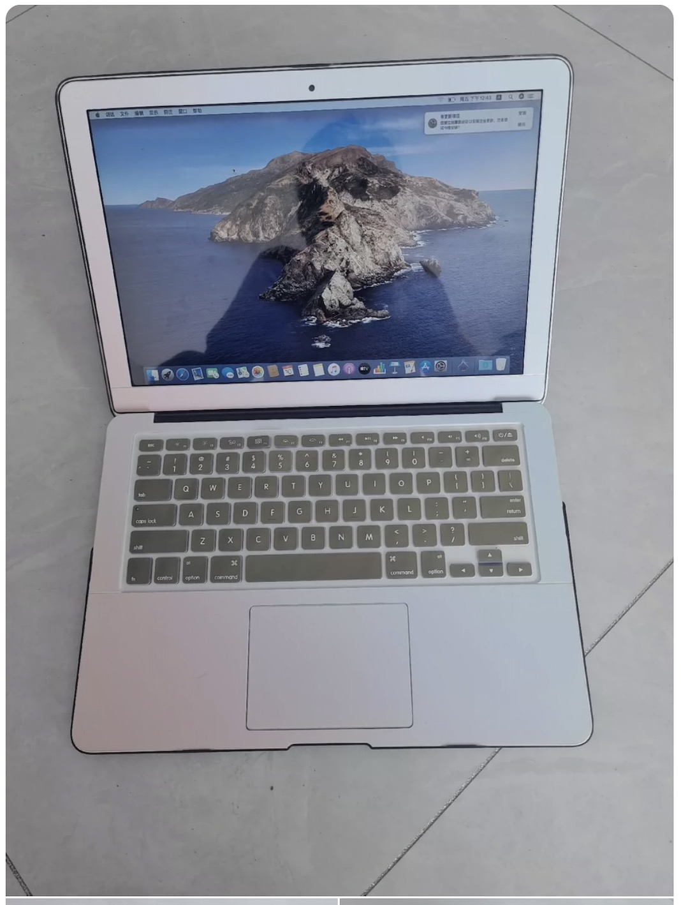
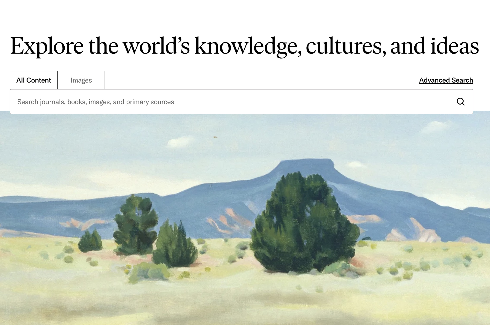
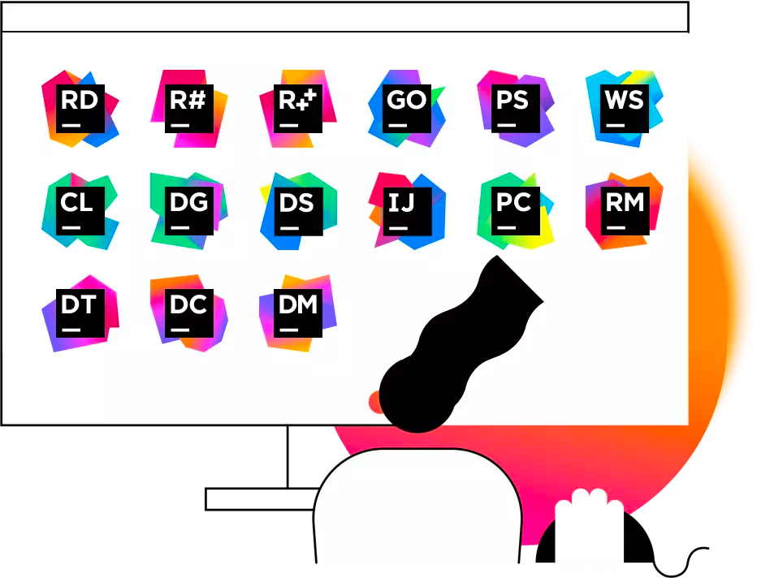

# 欢迎来到道尔顿学院 :tada:！

当然，相信你之前更熟悉的名字是「北大附国际部」。我们正式的名字是「Dalton Academy」。

无论你之前来自哪里，在道院，你将开始一段全新的旅程。以防万一你还不了解：

:::info
道尔顿学院成立于2010年，前身是北大附中对外教育合作开放交流的基地。我们鼓励学生以任务驱动型的方式自主学习，助力你在中英文通识教育中茁壮成长，为未来出国留学做好准备。在这里，你不仅可以选择自己感兴趣的课程，还可以在导师和书院的帮助下进行学习探究。

我们的目标是培养具有创新精神、责任感、正直品质、好奇心、勇于蜕变的领军人才，他们不仅拥有家国情怀和国际视野，更能面向未来的挑战。除了常规课程，我们还为有余力的学生提供了挑战性更大的荣誉课程，并且你还可以自己开设课程！（当然需要经过批准）

为了扩展学习视野，道尔顿学院还会特别邀请了来自世界顶尖大学和研究机构的专家给学生们进行大学级别的讲座，以及世界名校的大学宣讲会。这是一个让你在学习中不断发现、探索、成长的地方，期待你在这里留下你的足迹，与我们共同迎接未来的挑战与机遇！
:::

[[toc]]

## GPA

:::details GPA是什么？
GPA，全称 Grade Point Average，即平均绩点，是衡量学生学术成绩的一种重要指标。它是一种用数字表示的绩效评估。在道尔顿学院，我们的 GPA 满分是 4.5。

GPA的计算方法是将你每门课程的成绩转化为对应的绩点，再根据每门课的学分进行加权平均。

以下是道尔顿学院 GPA 和分数的[转换表](https://bdfz.sharepoint.com/sites/xn--48srpk80klcfizc/SitePages/%E8%AF%BE%E7%A8%8B%E8%AF%84%E4%BB%B7-Course.aspx)。

| 成绩     | 等级 | GPA | GPA（HL课程） |
|--------|----|-----|-----------|
| 95-100 | A+ | 4.5 | 5.0       |
| 90-94  | A  | 4   | 4.5       |
| 85-89  | B+ | 3.5 | 4         |
| 80-84  | B  | 3   | 3.5       |
| 75-79  | C+ | 2.5 | 2.5       |
| 70-74  | C  | 2   | 2         |
| 60-69  | D  | 1   | 1         |
| 低于60   | F  | 0   | 0         |

在道院，我们鼓励学生追求学术卓越，但也强调全面发展。GPA虽重要，但它并不是衡量你个人价值或未来成功的唯一标准。除了学术成绩，课外活动、领导能力、社会服务等方面同样重要。我们相信，一个全面发展的学生，不仅在学业上表现优异，还能在多方面展现自己的才华和潜力。

因此，在追求高GPA的同时，也不要忘记探索你的兴趣，参与各类活动，培养你的综合能力。这样，当你申请大学时，你将不仅有一个亮眼的 GPA，还会有一个丰富多彩的个人经历，这将使你在众多申请者中脱颖而出。
:::
看到这个标题你或许会有点扫兴。或许刚刚进入崭新的高中生活，你更关心学校的其它方面——无论是各种各样的社团，还是令人激动的「无纸化教学」，~~又或是学校的Wi-Fi能不能玩游戏~~。但是，提前知道相关的信息、做好准备，才能让你不至于在高三的申请季时手忙脚乱。
如果你现在就对申请的内容感兴趣，请查看[申请指南](./applying)

### 平时成绩？

或许你很早就听说过「平时成绩」这个词。但是，这个东西有用吗？从小学开始，唯一重要的就是期中、期末的考试成绩。对于很多同学来说，「平时成绩」只不过是评价手册的一串A而已。
:::warning
但是，在国际部，「平时成绩」/ GPA远比考试成绩重要。
:::
为什么会这么说？
国外的大学，不同于中国的教育体系，不是「考」进去的，而是通过「申请」。而GPA，可以视作为你申请国外大学的最重要的指标。在递交大学申请时，你需要递交高中整个三年的GPA（美国大学还需要递交初三一年的成绩单），这说明在整个高中期间，你的任何一门课都可以影响到你的大学申请结果。
:::details 等等，那托福、SAT呢？
你说的对，GPA 只是你申请中的一部分，你还同时需要递交语言成绩和/或标化成绩。查看[申请指南](guide/high-school-study/international/applying)了解更多
:::

首先，有一些同学可能习惯于平时摆烂，在考试的前几天、甚至前一晚突击。当然，只要临时抱佛脚的能力够强，只要分高就行。毕竟「不管黑猫白猫，能捉到老鼠就是好猫」。但是，在道尔顿学院，你可能会看到一下这些情况：

- 同学A理科学霸，每次物理、化学考试都是接近满分，但是A从来不做作业，甚至经常缺席。最终，A因为多门课程挂科而转学去高考了。
- 同学B认真听话，每门课都准时出席，课后布置的作业也都认真完成，要求的报告也一丝不苟的准备。虽然B在理科上稍微欠缺天赋，但最后还是拿到了4.0+的好绩点。
  造成这些情况的原因很简单：在道尔顿学院，考试的分数可能只占总成绩的50%，甚至更少——也就是说，就算你是天才少年，考试次次100，但是你完全不写作业、参加课堂活动，那么你也最多只能拿到50分（及格是60分），迎接你的就是挂科重修了。
  :::warning
  你可能在社交平台上看到不少国内的大学生用「挂科」来打趣，甚至攀比自己挂了几门。但是，「挂科」在道院，以及所有未来申请国外本科的学生来说，都是一件非常严重的事情。如果你的GPA低于3.0，你可能无法申请到学校。
  :::
  不过大可不必担心，只要你的学习态度端正，不是上面极端的例子，那么你是肯定不会挂科的。
  以PHD1101这一门高一物理课为例：

| 评价项               | 占分  |
|-------------------|-----|
| Homework （作业）     | 35  |
| Quiz（小测）          | 15  |
| Midterm（期中考试）     | 10  |
| Lab（实验室报告）        | 10  |
| Final（期末考试）       | 10  |
| Test （章测）         | 10  |
| Group Work （小组活动） | 10  |
|                   | 100 |

可以看出，只要你作业认真写，实验报告按照要求交，小组活动不摸鱼，那么就能至少拿到 35+10+10 = 55分。而大多数课程的小测都是可以通过改错来补回扣掉分数的一半。也就是如果你满分100分的卷子得了60分，那么改错通过后，你的分数就是 60+(100-60)/2 = 80分。（偶尔期中期末考试甚至也可以，但是这个不要强求）
:::info 我作业错很多怎么办？
虽然作业是要计分的，但是大多数老师也都支持通过改错来补回扣掉的分数。所以一定要认真对待每一项作业，包括改错。
:::

此外，很多文科课程是没有考试的。取而代之的则是论文、研讨会（[Socratic Seminar](#)）以及Presentation（做PPT）。所以对于这些课来说，平时大大小小的作业就占据了你大部分的成绩。这也是为什么A同学会挂掉很多课的原因。

### 我需要多高GPA？
如果你想申请到一个排名还不错的大学的话，请尽量将GPA保持在4.0以上，也就意味着每门课的平均等级是A。
这并不难！如果一门课考试占比50%，那么拿满平时分，考试只需要考到80分就能拿到A了 。不同于中考、高考等选拔性考试，道尔顿的考试大多数都是通过型考试，纯粹考知识点，会了就行。更何况各科都有0.1-3分不等的bonus（附加分数），会直接加在总成绩上。
:::info
当然，这些bonus大多数都是需要你自己去争取的。例如完成额外的作业、报名学科相关竞赛、在竞赛中获奖。所以尽可能提前准备，老师们会很反感在学期末厚着脸皮要 bonus 的行为的。
:::

---

## 书院选择
在被道尔顿录取后，你所需要做的第一件事情就是选择书院。北大附中采用书院制度，没有传统意义上的行政班。出国方向的学生可以选择「新民」和「至善」两个书院。具体的书院选择是非常主观的，请你根据自己的偏好选择，可以以两个书院的各类招新材料作为参考。

## 电子设备
正如在美国，到了一定年纪很多作业就必须得网上交，在道院电子设备可以说是必不可少的。在高一，你需要查看动辄上千页的各种科学课课本；在高二，你需要独立撰写 IRP (Independent Research Program) 论文；在高三，你需要撰写文书、递交各个大学的申请。一台得心应手的设备可以帮助你提高效率，不拖后腿。

### 笔记本电脑
:::info Before you read...
如果你已经有了一台心仪的笔记本电脑，那么请无视以下内容。
:::

对于笔记本电脑，大多数道院的学生的选择是 MacBook。你无需担心兼容性问题，道尔顿使用的所有系统都与 macOS 适配很好。MacBook 系列有着优秀的续航、屏幕、触控板和做工。在 2021 年后推出的 Apple 芯片（M 处理器系列）的续航非常充足，用一天肯定没问题，无需携带沉重的充电头。
:::info 关于充电
5层的教室仅在教室前后的墙壁上有插头。所以需要充电的话十分不方便，尽量提前充好电再去上课。6层的科学教室在天花板顶都配有插座，需要的时候可以拉下来使用。

此外，书院活动室和自习区域也都有插座，不过僧多粥少，能不能抢到就看你的本事了。

可以购买支持你笔记本电脑的移动电源，应急补电还是可以的。
:::

道尔顿的一些教室配备了 Apple TV，这意味着如果使用 MacBook，你可以直接通过 AirPlay 无线投屏，省去了没有转接线的尴尬。另外，你还可以通过 AirDrop 与老师和其它使用 Mac 的同学来隔空投送文件。

#### 我该选择哪款 Mac？
前往 [apple.com.cn/mac](https://apple.com.cn/mac) 根据预算挑选就可以。只要不买成下图这种的就可以

当然，如果你已经有了一台性能尚可的 Mac 或是 Windows 笔电，在道尔顿使用也完全没有问题。只要不出现离作业 ddl 还有 2 分钟时，电脑死机的情况:scream: 就可以（虽然但是，不推荐拖 ddl）

如果你是游戏玩家，那 Mac 可能不适合你。~~不过 M 芯片的 MacBook 可以通过 GPTK 来转译运行 Windows 游戏，感兴趣的自行网上搜索~~

### iPad
很多学生都偏好使用 iPad 来做笔记。因为各种理科课本都是上千页的 PDF，所以使用 iPad 搭配 Apple Pencil 可以很方便的进行标注。很多电子版的作业也可以使用 iPad 来进行手写提交，当然如果你偏好纸笔的笔记体验，也是完全没有问题的。
虽然学校禁止在校内使用手机，但是对平板不加限制。所以例如如果你需要点外卖，那么使用 iPad 在外卖软件上下单是完全合规的。

## 资源
### 学术资源
北大附中的很多网络资源和北京大学都是同步的。你只需连入校网，便可以使用北京大学学生的身份访问知网。当然，知网上大多都是中文文献。对于我们国际部学生，一个更常用的平台是 [Jstor](https://www.jstor.org/)。

Jstor 是一个收录了大量学术期刊的平台，你可以在上面找到你需要的大部分文献，在高二进行 IRP 研究的时候十分有帮助，同样使用学校 Wi-Fi 进行连接即可。此外，[Google Scholar](https://scholar.google.com/) 也是一个不错的选择，但是需要你自行解决访问问题。

### 软件资源
- Jetbrains 开发套装

如果你需要写代码，可以通过学校邮箱申请 Jetbrains 的 [Free Educational License](https://www.jetbrains.com/community/education/#students)，免费使用售价上千元的 IDE。

- GitHub Student Developer Pack

GitHub 为学生提供了一系列的优惠，包括但不限于免费 .me 域名、$200 的 DigitalOcean 云服务器、$100 的 Azure 云服务、1Password、Canva 设计工具等等。你可以使用学校邮箱通过 [GitHub Education](https://education.github.com/) 申请。

- 滴滴打车学生优惠

在滴滴中可以认证成为北京大学学生，每周都可以领券。

欢迎补充……